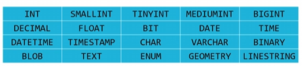

# its-about-data

## SQL

### Flat-file database

You read data from actual files like CSV

```python
# We have a CSV file called "favorites.csv" with 3 columns timestamp, language, problem
import csv

# Using reader()
with open("favorites.csv", "r") as file:
	reader = csv.reader(file)
	next(row) # To not show the header of the table
	for row in reader:
		favorite = row[1]
		print(favorite) # It prints the language column's values


# Using DictReader() and manual return counting of each language
with open("favorites.csv", "r") as file:
	reader = csv.DictReader(file)

	# Define variables to count the languages
	scratch, python, c = 0, 0, 0

	for row in reader:
		favorite = row["language"]
		# print(favorite) # It prints the language column's values
		if favorite == "Scratch":
			scratch += 1
		elif favorite == "Python":
			python += 1
		else favorite == "C":
			c += 1

print(f"Scratch: {scratch}")
print(f"Python: {python}")
print(f"C: {c}")


# Using DictReader() and dynamic return counting of each language
with open("favorites.csv", "r") as file:
	reader = csv.DictReader(file)

	counts = {} # a list

	for row in reader:
		favorite = row["language"]
		if favorite in counts:
			counts[favorite] += 1
		else:
			counts[favorite] = 1

def get_value(language):
	return counts[language]

for favorite in sorted(counts, key=get_value, reverse=True): # You can use lambda here
	print(f"{favorite}: {counts[favorite]}")

favorite = input("Favorite: ")
if favorite in counts:
	print(f"{favorite}: {counts[favorite]}")
```

### Relational database

CREATE - INSERT

READ - SELECT

UPDATE

DELETE - DROP

CREATE TABLE table (column type, …);

```sql
sqlite3 favorites.db

.mode csv

.import favorites.csv favorites

.schema → CREATE TABLE IF NOT EXISTS “favorites”(”Timestamp” TEXT, “language” TEXT, “problem” TEXT);

SELECT * FROM favorites;

-- COUNT, AVG, MAX, MIN, DISTINCT, LOWER, UPPER
SELECT DISTINCT(language) FROM favorites;
SELECT COUNT(DISTINCT(language)) FROM favorites;

-- WHERE, LIKE, ORDER BY, LIMIT, GROUP BY
SELECT COUNT(*) FROM favorites WHERE language = 'C';
SELECT language, COUNT(*) FROM favorites GROUP BY language;
SELECT language, COUNT(*) FROM favorites GROUP BY language ORDER BY COUNT(*) DESC;
SELECT language, COUNT(*) FROM favorites GROUP BY language ORDER BY COUNT(*) DESC LIMIT 1;

UPDATE table SET column = value WHERE condition;
DELETE FROM table WHERE condition;

-- Data types
BLOB, INTEGER, NUMERIC, REAL, TEXT

-- Constraints
NOT NULL -- it is required
UNIQUE -- it has no duplication value

PRIMARY KEY(field)
FOREIGN KEY(field) REFERENCES table(field)

-- Nest tables
SELECT field_1
FROM table_1
WHERE primary_key IN (SELECT foreign_key FROM table_2 WHERE condition);

-- Join tables
SELECT * FROM table_1
JOIN table_2
ON table_1.primary_key = table_2.foreign_key;

SELECT * FROM table_1, table_2, table_3
WHERE table_1.primary_key = table_2.foreign_key
AND table_2.foreign_key = table_3.primary_key
AND condition;

-- Indexes, find data fast
CREATE INDEX what_you_call_it ON table (field); -- B-trees
```

```python
from cs50 import SQL

db = SQL("sqlite:///favorites.db")

favorite = input("Favorite: ")

rows = db.execute("SELECT COUNT(*) AS n FROM favorites WHERE problem = ?", favorite)

for row in rows:
	print(row["n"])
```

### Race condition

```sql
BEGIN TRANSACTION
COMMIT
ROLLBACK
```

```python
db.execute("BEGIN TRANSACTION")
rows = db.execute("SELECT likes FROM posts WHERE id = ?", id)
likes = rows[0]["likes"]
db.execute("UPDATE posts SET likes = ? WHERE id = ?", likes + 1, id)
db.execute("COMMIT")
```

### SQL injection attacks

### Database design

**********************************Design principles**********************************

* Each table should be a collection of a **************************single entity**************************
* For example, we should have different tables for each of the ******************************************************students, houses, and student-house assignments.******************************************************

### Data types

